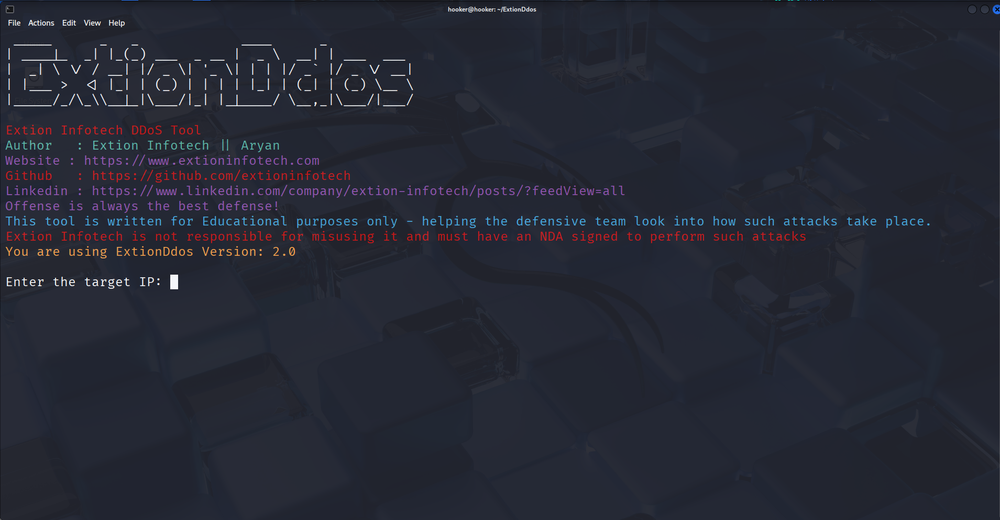

# 
Disclaimer

<b>This tool is provided for educational and research purpose only. Extion infotech is not   responsible for any misuse of this tool. 
We use it to test under NDA agreements with clients and their consents for pentesting purposes and we never encourage to misuse or take responsibility for any damage caused !
#
# Distributed Denial of Services - DDoS 
# This tools is developed by Extion infotech for testing and practicing of Cybersecurity interns 

An Advanced Layer 7 DDoS tool written by Cybersecurity team of Extion infotech

# Description

**ExtionDdos** is an Offensive Security Tool written in Python3 by Aryan from Extion Infotech for the students enrolled in Extion Cyberpath, designed to perform **Distributed Denial of Service (DDoS)** attacks.

### **Focus on Layer 7 Attacks**

The focus of the tool is on **layer 7 attacks**, which are known to be the most advanced types of DDoS attacks. The tool offers the user a choice between three different DDoS attack methods: 

- UDP Flood
- SYN Flood
- HTTP Flood

### **What is DDoS?**

DDoS is an abbreviation for **Distributed Denial of Service**, a type of attack aimed at disrupting the availability of a targeted website, network, or service. This attack is typically carried out by overwhelming the target with a large amount of traffic from multiple sources. In the context of red teaming and pentesting, DDoS attacks are simulated to evaluate the ability of the blue team to withstand such sophisticated attacks.

### **Optimized for Speed and Efficiency**

"ExtionDdos" is optimized for speed and efficiency, making it a great choice for those looking to execute DDoS attacks in a timely and effective manner. The tool provides real-time feedback on the number of packets sent during the attack, enabling the user to monitor its progress.

### **User-Friendly and Easy to Use**

Moreover, the tool is designed with ease of use in mind, allowing even novice users to carry out advanced DDoS attacks with ease.

# New Features in Version: 2.0

• Focus on Layer 7 attacks: The tool is re-designed to specifically target the most sophisticated types of DDoS attacks, known as layer 7 attacks.

• Multiple attack types: The tool offers three different types of DDoS attacks: UDP Flood, SYN Flood, and HTTP Flood, giving the user flexibility in their choice of attack.

• Optimized for speed: ExtionDdos is designed to perform attacks quickly and efficiently, making it an ideal choice for those looking to disrupt the target as quickly as possible.

• Real-time feedback: The tool provides real-time feedback on the number of packets sent during the attack, allowing the user to monitor the progress of the attack.

• User-friendly: The tool is designed to be user-friendly, with a simple and intuitive interface, allowing even inexperienced users to perform sophisticated DDoS attacks with ease.

# Installation

`git clone https://github.com/extioninfotech/extionddos.git`

`cd extionddos`

`chmod +x extionddos.py`

`python3 extionddos.py`

# Instructions

All you have to do when you run this tool is provide it with:

- Target IP
- Target Port
- Duration to attack

It will then start sending 1337 packets to that port for the time you gave it.

Note, the time is in seconds.

It is recommended to use high bandwidth, such as a VPS Server.

# Screenshots

**Main Menu**

# Compatibility

Tested on Kali Linux, Parrot OS, Termux & MacOS

# Updates

V2.0

Added 3 attack options to choose from
Error Handlings
Optimizations
Check Features!

V1.2

We just converted this tool from Python2 to Python3! added some colors, added time to perform the attack as well!

<h2 align="center">
  <a href="https://docs.google.com/forms/d/e/1FAIpQLSevJAasjy4LYz9iuAzcTZu7oppCqni7uoVxzVSDm5pNVp17ww/viewform?pli=1" target="_blank">Extion Infotech Internships</a>
</h2>

We offer a wide range of services, including:

Trainings – Industry-focused skill development programs.
Internships – Hands-on experience in various technical domains.
Staffing & Placements – Career assistance and recruitment solutions.
Software & Web Development – Custom software, web, and app development.
Digital Marketing & Promotion – SEO, social media marketing, and lead generation.
Branding & Design – Creating strong and memorable brand identities.

# 
You can click below image

### Credit's
Copyright © 2025 by [Extion Infotech](https://extioninfotech.com)
